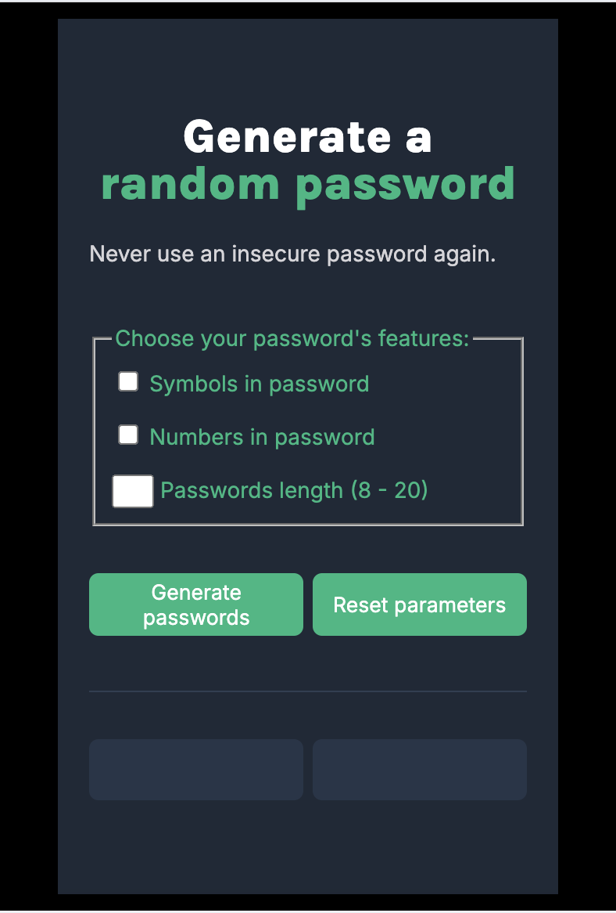
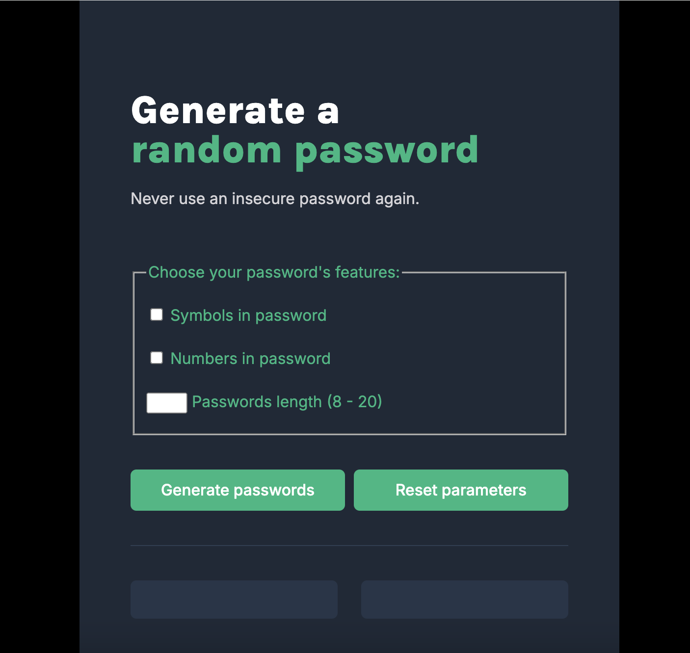

Initial design [LINK](https://www.figma.com/design/NEj9JDycMjF3XKXq7swoc9/Random-Password-Generator-(New-version)?node-id=102-702&t=WfhbhyelhK3auQcx-0)

Random password generator [DEMO LINK](https://random-password-withjs.netlify.app/)

Added functionality to the initial design:
- add characters to the password
- add numbers to the password
- select password length
- reset the selected parameters
- adaptation to different screen sizes

